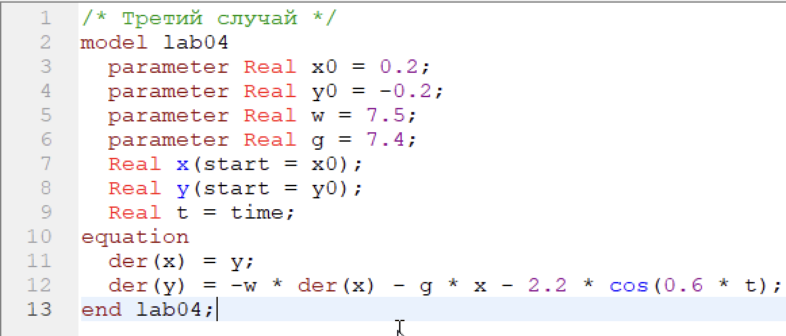

---
# Front matter
title: "Отчёт по лабораторной работе №4"  
subtitle: "Вариант 39"  
author: "Александр Олегович Воробьев"

# Generic otions
lang: ru-RU
toc-title: "Содержание"

# Bibliography
bibliography: bib/cite.bib
csl: pandoc/csl/gost-r-7-0-5-2008-numeric.csl

# Pdf output format
toc: true # Table of contents
toc_depth: 2
lof: true # List of figures
lot: true # List of tables
fontsize: 12pt
linestretch: 1.5
papersize: a4
documentclass: scrreprt
## I18n
polyglossia-lang:
  name: russian
  options:
	- spelling=modern
	- babelshorthands=true
polyglossia-otherlangs:
  name: english
### Fonts
mainfont: PT Serif
romanfont: PT Serif
sansfont: PT Sans
monofont: PT Mono
mainfontoptions: Ligatures=TeX
romanfontoptions: Ligatures=TeX
sansfontoptions: Ligatures=TeX,Scale=MatchLowercase
monofontoptions: Scale=MatchLowercase,Scale=0.9
## Biblatex
biblatex: true
biblio-style: "gost-numeric"
biblatexoptions:
  - parentracker=true
  - backend=biber
  - hyperref=auto
  - language=auto
  - autolang=other*
  - citestyle=gost-numeric
## Misc options
indent: true
header-includes:
  - \linepenalty=10 # the penalty added to the badness of each line within a paragraph (no associated penalty node) Increasing the value makes tex try to have fewer lines in the paragraph.
  - \interlinepenalty=0 # value of the penalty (node) added after each line of a paragraph.
  - \hyphenpenalty=50 # the penalty for line breaking at an automatically inserted hyphen
  - \exhyphenpenalty=50 # the penalty for line breaking at an explicit hyphen
  - \binoppenalty=700 # the penalty for breaking a line at a binary operator
  - \relpenalty=500 # the penalty for breaking a line at a relation
  - \clubpenalty=150 # extra penalty for breaking after first line of a paragraph
  - \widowpenalty=150 # extra penalty for breaking before last line of a paragraph
  - \displaywidowpenalty=50 # extra penalty for breaking before last line before a display math
  - \brokenpenalty=100 # extra penalty for page breaking after a hyphenated line
  - \predisplaypenalty=10000 # penalty for breaking before a display
  - \postdisplaypenalty=0 # penalty for breaking after a display
  - \floatingpenalty = 20000 # penalty for splitting an insertion (can only be split footnote in standard LaTeX)
  - \raggedbottom # or \flushbottom
  - \usepackage{float} # keep figures where there are in the text
  - \floatplacement{figure}{H} # keep figures where there are in the text
---

# Цель работы

Изучить модели гармонических колебаний и построить фазовые модели гармонического осцилятора для трех случаев: Колебания гармонического осциллятора без затуханий и без действий внешней силы,  c затуханием и без действий внешней силы, c затуханием и под действием внешней силы.  

# Задание

Постройте фазовый портрет гармонического осциллятора и решение уравнения гармонического осциллятора для следующих случаев:  

1. Колебания гармонического осциллятора без затуханий и без действий внешней силы  

$$\ddot{x} + 1.2x = 0$$

2. Колебания гармонического осциллятора c затуханием и без действий внешней силы  

$$\ddot{x} + 2\dot{x} + 4.3x = 0$$

3. Колебания гармонического осциллятора c затуханием и под действием внешней силы  

$$\ddot{x} + 7.4\dot{x} + 7.5x = 2.2\cos(0.6t)$$
	
# Теоретическое введение

Уравнение свободных колебаний гармонического осциллятора имеет следующий вид:  

$$\ddot{x} + 2\gamma\dot{x} + \omega^2_0 x = 0$$

где x – переменная, описывающая состояние системы (смещение грузика, заряд конденсатора и т.д.), $\gamma$ – параметр, характеризующий потери энергии (трение в
механической системе, сопротивление в контуре), $\omega_0$ – собственная частота колебаний, t – время. (Обозначения $\ddot{x} = \frac{\partial^2 x}{\partial t^2}, \dot{x} = \frac{\partial x}{\partial t}$)  

# Выполнение лабораторной работы

**1. Пропишем программу для отображения модели первого случая: Колебания гармонического осциллятора без затуханий и без действий внешней силы.** 

	Зададим исходные переменные и пропишем уровнение для этого случая:

{ #fig:001 width=70% }  

	Запускаем модель для времени 0 < t < 55, с шагом 0,05:

{ #fig:002 width=70% }  

{ #fig:003 width=70% }  

**2. Изменим программу для второго случая: Колебания гармонического осциллятора c затуханием и без действий внешней силы.**  

	Изменим текущую переменную и добавим новую, запишем новое уравнение:  

{ #fig:004 width=70% }  

	Запускаем модель для с теми же установками симуляции для второго случая:  
{ #fig:005 width=70% }  
 

**3. Изменим программу для третьего случая: Колебания гармонического осциллятора c затуханием и под действием внешней силы.**  

	Изменим текущие переменные и добавим переменную для времени, запишем новое уравнение:  

{ #fig:006 width=70% }  

	Запускаем модель для с теми же установками симуляции для третьего случая:  

{ #fig:007 width=70% }  

# Выводы

В ходе выполнения лабораторной работы я познакомился с моделями гармонических колебаний и реализовал модели для трёх случаев: колебания гармонического осциллятора без затуханий и без действий внешней силы, c затуханием и без действий внешней силы, c затуханием и под действием внешней силы.  

# Список литературы{.unnumbered}

	1. Кулябов Д.С. Лабораторная работа №4. Модель гармонических колебаний [Электронный ресурс] - 4 с. 
	2. Кулябов Д.С. Лабораторная работа №4. Варианты [Электронный ресурс] - 23 с. 

::: {#refs}
:::
